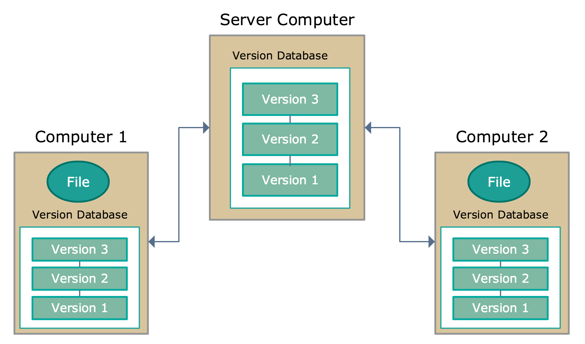
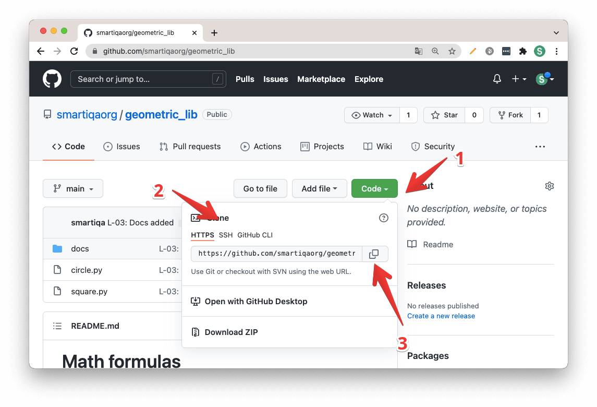

# Инструкция для работы с GIT и удалёнными репозиториями

## Удаленный (иногда говорят "внешний") репозиторий 
    – это версии вашего проекта, сохраненные на удаленном сервере. Доступ к репозиторию на таком сервере может осуществляться по интернету или по локальной сети.
***Удаленный репозиторий – полноценный репозиторий, ничем не отличающийся от локального. У удаленного репозитория есть собственные ветки, собственный указатель HEAD, своя история коммитов и так далее.***

Для соместной работы над одним репозиторием используется платформа GitHub. В первую очередь, необходимо иметь аккаунт на сайте GitHub.com. Затем нужно создать удалённый репозиторий. Когда данный этап уже выполнен, копируете ссылку удалённого репозитория.

Если мы подключим удаленный репозиторий к своему локальному, то у нас появятся копии всех ссылочных объектов удаленного репозитория. То есть, например, у удаленного репозитория есть ветка main, а у нас будет копия этой ветки – origin/main. Все такие ссылочные объекты (указатели, ветки и теги) удаленного репозитория хранятся почти там же, где и у локального – в директории *.git/refs/remotes/<имя_удаленного_репозитория>.*

*Для того, чтобы связать созданный вами локальный репозитарий с удаленным, выполним такую команду:*

>***git remote add origin 'ссылка'***

После работы над файлом необходимо его сохранить, закоммитить и отправить в удалённый репозиторий. **Сделать это можно с помощью команды:**

>***git push -u origin master***

**Имя удаленного репозитория** в команде ***"git remote add"*** вы можете придумать сами. Впоследствии, при работе с этим удаленным репозиторием, вы будете обращаться к нему по придуманному имени. Принято называть удаленный репозиторий origin, но строго говоря, никаких ограничений здесь нет.

Со ссылкой на удаленный репозиторий тоже все просто. Мы работаем с GitHub, поэтому эту ссылку можно взять, нажав на большую зеленую кнопку Code на странице репозитория на GitHub.

Вам предложат выбрать одну из трех ссылок: для протоколов https и ssh и для клиента GitHub на компьютер. Вот примеры этих трех ссылок для репозитория geometric_lib известного вам по практическим занятиям этого курса:

    HTTPS-ссылка: https://github.com/smartiqaorg/geometric_lib.git
    SSH-ссылка: git@github.com:smartiqaorg/geometric_lib.git
    GitHub CLI ссылка: gh repo clone smartiqaorg/geometric_lib

# Отключение удаленного репозитория от локального. Команда git remote remove.
Иногда возникает необходимость забыть удаленный репозиторий. Для этого нужно воспользоваться командой 
>***git remote remove*** 

Также есть данные команды для работы с удалённым репозиторием:

    git push origin - Замерджить все ветки локального репозитория на удаленный репозиторий 
    git push origin master - Аналогично предыдущему, но делается пуш только ветки master
    git push origin HEAD - Запушить текущую ветку, не вводя целиком ее название
    git pull origin - Замерджить все ветки с удаленного репозитория
    git pull origin master - Аналогично предыдущему, но накатывается только ветка master
    git pull origin HEAD - Накатить текущую ветку, не вводя ее длинное имя
    git push -f - залить на сервер измененные коммиты
    git push origin :branch-name - Удалить бранч из репозитория на сервере

Если хотите сбросить ветку к версии на удалённом репозитории, используйте команду:
>***"git reset --hard origin/master"*** 
или
 ***"git reset --hard origin/<название_ветки>"***

# Git fetch
**Git fetch** — это основная команда, которая используется для загрузки содержимого из удаленного репозитория. Чтобы обновить локальный репозиторий до состояния удаленного репозитория, команда git fetch используется в сочетании с командами git remote , git branch , git checkout и git reset .

**Команды fetch:**
git fetch origin - Скачать все ветки с origin, но не мерджить их в локальный репозиторий
git fetch origin master - Аналогично предыдущему, но только для одной заданной ветки
